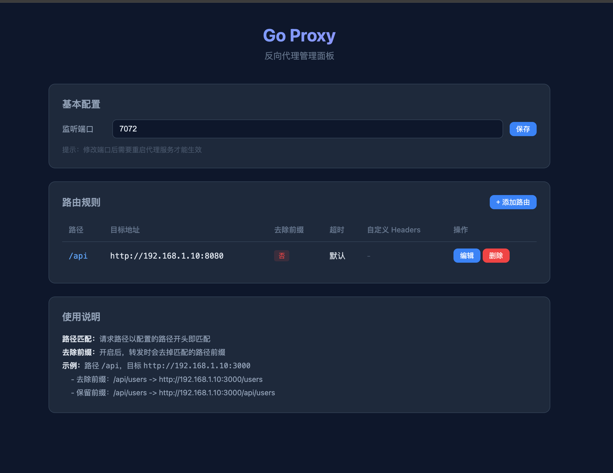

# Go Proxy

一个轻量级的反向代理工具，提供 Web GUI 管理界面，支持路径路由、自定义 Headers、超时控制、配置热重载等功能。

## 预览



## 功能特性

- **反向代理** - 基于路径前缀匹配，类似 nginx 的 `proxy_pass`
- **去除前缀** - 可配置转发时是否去掉路径前缀（`strip_prefix`）
- **自定义 Headers** - 每条路由可配置自定义请求头
- **超时控制** - 每条路由可设置超时时间，超时返回 504，目标不通返回 502
- **Web GUI** - 暗色主题管理面板，增删改查路由，实时生效
- **配置热重载** - 修改配置文件自动生效，无需重启
- **单文件部署** - Web 页面通过 `embed` 打包进二进制，无需额外文件
- **请求日志** - 每次请求输出源地址、目标地址、状态码、耗时

## 快速开始

### 编译

```bash
go build -o go-proxy ./cmd/go-proxy/
```

### 一键多平台打包

```bash
./build.sh
```

输出文件在 `dist/` 目录：

```
dist/
├── go-proxy-darwin-arm64
├── go-proxy-darwin-amd64
├── go-proxy-linux-arm64
├── go-proxy-linux-amd64
└── go-proxy-windows-amd64.exe
```

### 使用

**方式一：配置文件启动**

```bash
# 创建配置文件
cat > config.yaml << 'EOF'
port: 7070
routes:
  - path: /api
    target: http://192.168.1.10:3000
    strip_prefix: true
    timeout: 10
    headers:
      X-Api-Key: my-secret-key
      Authorization: Bearer token123
  - path: /web
    target: http://192.168.1.20:8080
    strip_prefix: false
EOF

# 启动
./go-proxy -config config.yaml
```

**方式二：命令行参数**

```bash
./go-proxy -port 7070 -route "/api=http://192.168.1.10:3000:true,/web=http://192.168.1.20:8080:false"
```

### 命令行参数

| 参数 | 说明 | 默认值 |
|------|------|--------|
| `-config` | 配置文件路径 | `config.yaml` |
| `-port` | 代理监听端口 | 配置文件中的值或 `8080` |
| `-admin-port` | Web GUI 端口 | 代理端口 + 1 |
| `-route` | 命令行指定路由，逗号分隔 | - |

路由格式：`路径=目标地址[:是否去除前缀]`

示例：
```bash
# 去除前缀（默认）
./go-proxy -route "/api=http://192.168.1.10:3000:true"

# 保留前缀
./go-proxy -route "/api=http://192.168.1.10:3000:false"
```

## 配置文件

支持 YAML 格式：

```yaml
port: 7070                    # 代理监听端口
routes:
  - path: /api                # 匹配路径前缀
    target: http://192.168.1.10:3000  # 转发目标
    strip_prefix: true        # 是否去除路径前缀
    timeout: 10               # 超时时间（秒），0 或不填为默认 30s
    headers:                  # 自定义请求头
      X-Api-Key: my-secret
      Authorization: Bearer token
```

### 路径匹配规则

请求路径以配置的路径**前缀匹配**，匹配后转发到目标地址。

| 配置路径 | strip_prefix | 请求路径 | 转发到 |
|---------|-------------|---------|-------|
| `/api` | `true` | `/api/users` | `http://target/users` |
| `/api` | `false` | `/api/users` | `http://target/api/users` |
| `/api` | `true` | `/api/users?id=1` | `http://target/users?id=1` |

### 状态码说明

| 状态码 | 说明 |
|-------|------|
| `200` | 正常转发，后端响应成功 |
| `404` | 无匹配路由 |
| `502` | 目标地址不可达（连接拒绝等） |
| `504` | 请求超时 |

## Web GUI

启动后访问 Web GUI 管理面板（默认地址 `http://localhost:端口+1`）：

- 查看所有路由规则
- 添加 / 编辑 / 删除路由
- 配置自定义 Headers
- 设置超时时间
- 修改后自动保存到配置文件


## 配置热重载

启动后修改配置文件，代理会自动检测变更并重新加载，无需重启：

```bash
# 代理运行中，直接编辑配置文件
vim config.yaml

# 日志会输出：
# [config] reloaded from file (port=7070, routes=3)
```

## 请求日志

每次请求输出一行日志：

```
[proxy] 192.168.1.5:12345 GET /api/users -> http://192.168.1.10:3000/users 200 12ms
[proxy] 192.168.1.5:12346 GET /unknown -> 404 0ms (no route)
[proxy] 192.168.1.5:12347 GET /down/test -> http://192.168.1.99:3000/test 502 5ms (connection refused)
[proxy] 192.168.1.5:12348 GET /slow/test -> http://192.168.1.10:3000/test 504 10001ms (timeout)
```

## 项目结构

```
.
├── cmd/go-proxy/main.go           # 程序入口
├── internal/
│   ├── config/config.go           # 配置管理（线程安全、热重载）
│   ├── proxy/proxy.go             # 反向代理核心
│   └── admin/
│       ├── admin.go               # Web GUI API
│       └── static/index.html      # Web GUI 前端（embed 打包）
├── build.sh                       # 多平台打包脚本
├── go.mod
├── go.sum
└── README.md
```

## License

MIT
